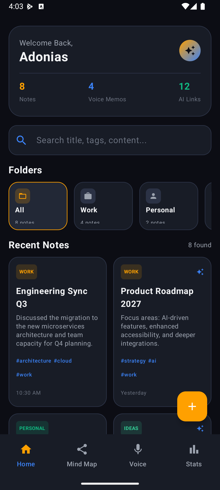
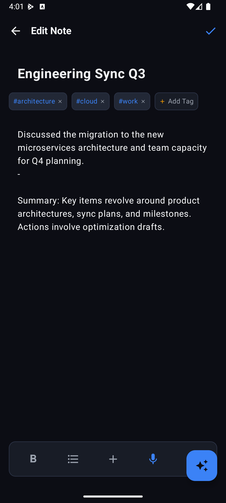
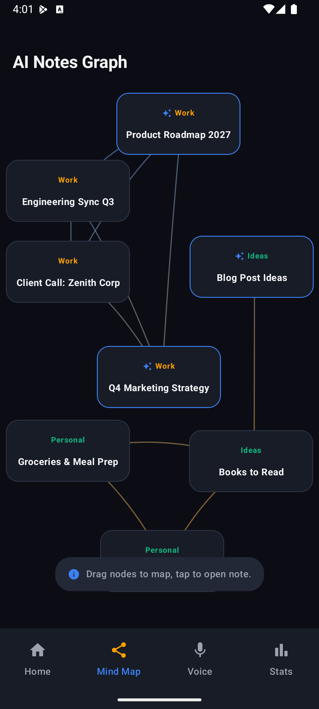
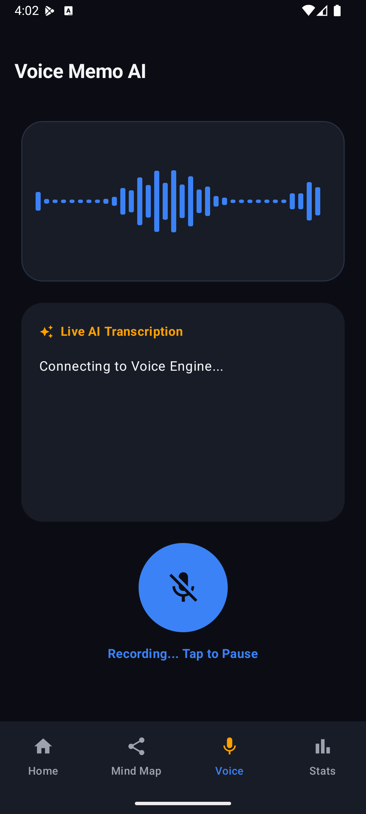
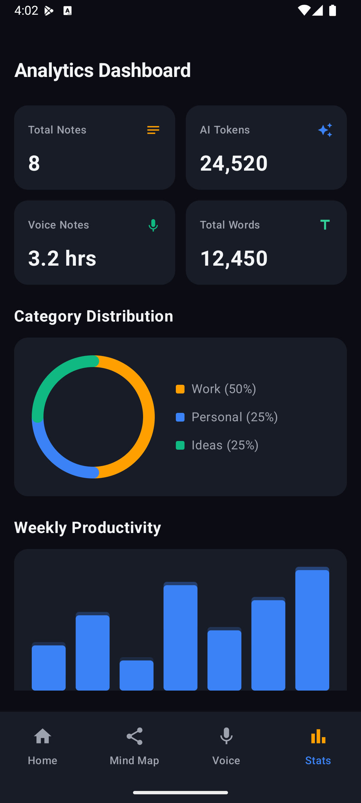

# Slate — Enterprise AI Smart Notebook

Slate is a native Android smart notebook application designed for high-performance and premium visual aesthetics. Built with Kotlin and Jetpack Compose, the app integrates advanced note-taking capabilities with custom Canvas-drawn visualizers and simulated AI Copilot tools. 

The user interface uses a **Carbon Slate & Electric Amber** design system (Midnight Obsidian black backgrounds, Carbon Gray cards, and vibrant gold-orange and ice-blue neon accents) offering a dark-mode experience.

---

## 📸 Screenshots

<table>
  <tr>
    <td><br/><b>Dashboard</b></td>
    <td><br/><b>Note Editor</b></td>
    <td><br/><b>Mind Map</b></td>
  </tr>
  <tr>
    <td><br/><b>Voice Recorder</b></td>
    <td><br/><b>Analytics</b></td>
    <td></td>
  </tr>
</table>

---

## 🚀 Key Features

### 1. Home Dashboard
*   **Stats Summary Widget:** Dynamic header displaying total note count, audio records, and AI-derived tag connection counts.
*   **Folder Carousels:** Categorized horizontal scrolling carousel mapping notes to folders (`Work`, `Personal`, `Ideas`).
*   **Staggered Notes Grid:** Fluid, responsive grid displaying hashtags, edit timestamps, and AI processing status badges.
*   **FAB Hub:** Floating action menu that expands with micro-animations to route users to text notes or voice memos.

### 2. Note Editor & AI Chat Panel
*   **Rich Format Toolbar:** Shortcut controls for inline bolding, lists, dictation, and assistant tools.
*   **Dynamic Hashtag Chips:** Inline tag manager allowing users to add or remove tags, updating the note's metadata index in real-time.
*   **Dual-Tab AI Sheet:**
    *   *AI Actions:* Traditional single-click tools for summarization, action item extraction, and Spanish translation with shimmer loading indicators.
    *   *Copilot Chat:* Simulated real-time chatbot playground that lets you chat *about* note contents, streaming contextual answers back to the user.

### 3. Interactive Notes Graph (Mind Map)
*   **Draggable Node Graph:** Custom Canvas layout rendering notes as floating nodes.
*   **Neon Connection Curves:** Draws ice-blue bezier curves connecting notes that share matching hashtags or topics.
*   **Gesture Physics:** Draggable pointer gesture listeners allow users to arrange nodes interactively, recalculating connecting curve math in real-time.
*   **Navigation Actions:** Tapping any node immediately opens the respective note editor.

### 4. Voice Memo AI Recorder
*   **Animated Waveform Visualizer:** Custom canvas-based bar columns drawing dynamic heights using sine math, simulating audio recording frequencies.
*   **Live Transcription Stream:** Simulates speech-to-text dictation, streaming paragraphs line-by-line.
*   **Notebook Integrator:** Auto-saves finished speech sessions as new notes, formatting transcripts automatically.

### 5. Custom Analytics Dashboard
*   **Canvas Donut Chart:** A segmented neon donut ring displaying notes distribution across folders.
*   **Productivity Bar Chart:** Custom canvas-drawn weekly column chart with glow gradient fills plotting note volume over time.
*   **System Metric Grid:** Visual trackers measuring character counts, word counts, and AI token utilization.

---

## 🛠️ Architecture & Tech Stack

The app is built following **Clean Architecture** principles and the standard **MVVM (Model-View-ViewModel)** design pattern.

*   **Language:** Kotlin 2.0.21
*   **Build Toolchain:** Gradle 8.12, Android Gradle Plugin 8.9.1
*   **UI Framework:** Jetpack Compose, Material Design 3
*   **Navigation:** Jetpack Navigation Compose (Standard routing stack)
*   **Custom Graphics:** Jetpack Compose Canvas APIs (`drawArc`, `drawPath`, `drawRoundRect`, `nativeCanvas`)
*   **Asynchronous Logic:** Kotlin Coroutines & Flow APIs

---

## 📂 Project Structure

```
app/src/main/java/com/example/slate/
│
├── data/
│   └── model/
│       └── Note.kt             # Note data structures & cyberpunk mock database
│
├── theme/
│   ├── Color.kt                # Carbon Obsidian & Electric Amber color palette
│   ├── Theme.kt                # Material3 Dark Theme settings & edge-to-edge configuration
│   └── Type.kt                 # Type scale definitions
│
├── ui/
│   └── screens/
│       ├── DashboardScreen.kt  # Welcome metrics, folders, staggered notes grid
│       ├── NoteEditorScreen.kt # Editor, text toolbar, and AI Copilot sheet/chat
│       ├── MindMapScreen.kt    # Custom Canvas notes connection graph with drag gestures
│       ├── VoiceRecorderScreen.kt # Speech dictation screen with audio waveform
│       └── AnalyticsScreen.kt  # Custom Canvas Donut & Bar productivity charts
│
├── MainActivity.kt             # Entry point component hosting Content
└── Navigation.kt               # Bottom navigation and screen graph routes
```

---

## 📦 Getting Started

### Prerequisites
*   Android Studio Ladybug or newer
*   Android SDK Platform 34+
*   JDK 17+

### Building the Project
Clone the repository and compile using the Gradle wrapper in your terminal:
```bash
# Build the debug APK file
./gradlew assembleDebug

# Deploy and run the app on a connected emulator or device
./gradlew installDebug
```
